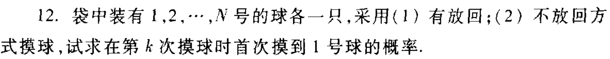
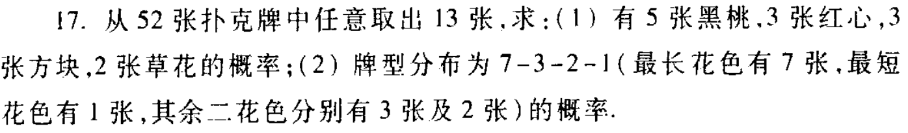
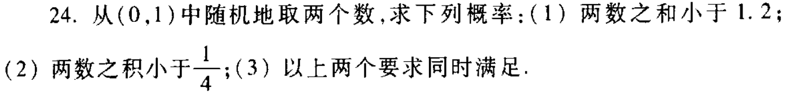
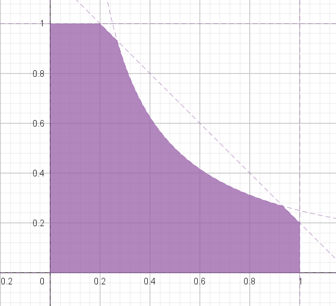
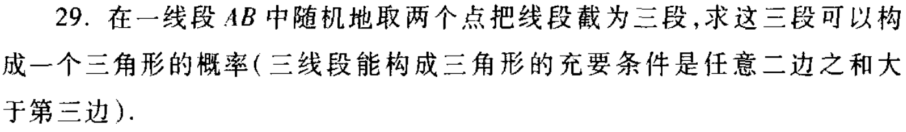

# 概率论与数理统计 作业二

> 第一章12，17，24，29

## 1.12

（1）有放回：

前k-1次均摸到其他球

$P=(\frac{N-1}{N})^{k-1}\frac{1}{N}$

（2）无放回：

由概率的对称性知，在第i次摸到该球之间是等概率的（由于不放回，“首次摸到”没有意义）

$P=\frac{1}{N}$

## 1.17

（1）

$P=\frac{C_{13}^5C_{13}^3C_{13}^3C_{13}^2}{C_{52}^{13}}$

（2）

$P=\frac{C_{13}^7C_{13}^3C_{13}^2C_{13}^1}{C_{52}^{13}}A_{4}^{4}$

## 1.24

（1）

第一个数落在k上的概率为$P_0(k)=\frac{(k+\frac{\varepsilon}{2})-(k-\frac{\varepsilon}{2})}{1-0}=\varepsilon$，而$\varepsilon=\Delta k$

第一个数落在k(1>k>0.2)上，两数之和小于1.2的概率为$P(k)=\Delta k\frac{1.2-k}{1}$

第一个数落在k(0.2>k>0)上，两数之和小于1.2的概率为$P(k)=\Delta k$

故两数之和小于1.2的概率为$P(k)=\int_{0}^{0.2}\Delta k+\int_{0.2}^{1}(1.2-k)\Delta k=k|_{0}^{0.2}+(1.2k-\frac{1}{2}k^2)|_{0.2}^{1}=0.68$

（2）

第一个数落在k(1>k>0.25)上，两数之积小于$\frac{1}{4}$的概率为$P(k)=\Delta k\frac{\frac{1}{4k}-0}{1}=\Delta k\frac{1}{4k}$

第一个数落在k(0.25>k>0)上，两数之积小于$\frac{1}{4}$的概率为$P(k)=\Delta k$

故两数之积小于$\frac{1}{4}$的概率为$P(k)=\int_{0}^{0.25}\Delta k+\int_{0.25}^{1}\frac{1}{4k}\Delta k=k|_{0}^{0.25}+(\frac{1}{4}In(k))|_{0.25}^{1}=0.25+0.25In(4)$

（3）

如下图着色部分即为所求：

第一个数落在k(0.2>k>0)上，概率为$P(k)=\Delta k$

第一个数落在k(0.42>k>0.25，1>k>0.78)上，概率为$P(k)=\Delta k\frac{1.2-k}{1}$

第一个数落在k(0.78>k>0.42)上，概率为$P(k)=\Delta k\frac{\frac{1}{4k}-0}{1}=\Delta k\frac{1}{4k}$

概率为$P=0.2+(1.2k-\frac{1}{2}k^2)|_{0.25}^{0.42}+(1.2k-\frac{1}{2}k^2)|_{0.78}^{1}+0.25In(k)|_{0.42}^{0.78}=0.61105+0.25In(\frac{13}{7})$

## 1.29

要求可以构成三角形的概率，即要求最大边长小于总长一半的概率。不妨令总长为1

若其边长为k(k<0.5)，则其为最大边概率为$P(k)=\frac{3k-1}{1}\Delta k$

当$k<\frac{1}{3}$时不可能为最大边

故概率为$P=\int_{\frac{1}{3}}^{0.5}\frac{3k-1}{1}\Delta k=\frac{1}{24}$