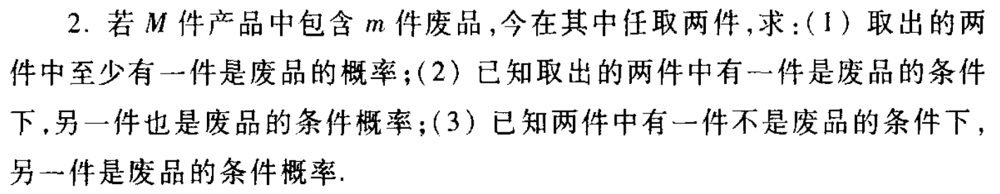
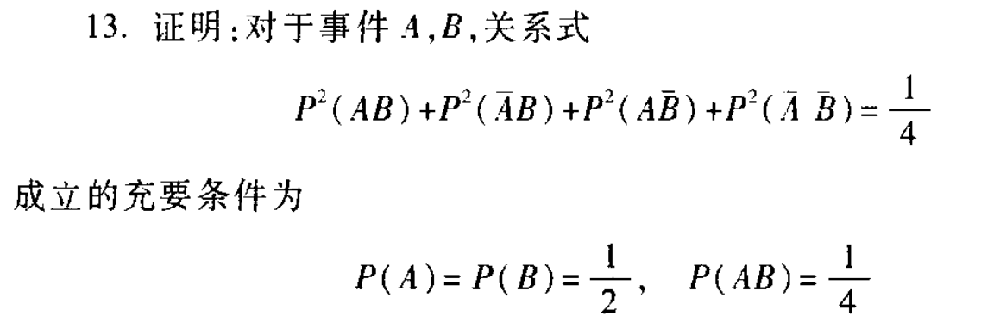

# 概率论与数理统计 作业三

> 第二章4，8，13，15

## 2.4

（1）

$P=1-\frac{C_{M-m}^{2}}{C_M^2}$

（2）

直接计算：

$P=\frac{m-1}{M-1}$

条件概率公式计算：

$P=\frac{\frac{C_{m}^2}{C_M^{2}}}{\frac{m}{M}}=\frac{m-1}{M-1}$

（3）

直接计算：

$P=\frac{m}{M-1}$

条件概率公式计算：

$P=\frac{\frac{m(M-m)}{C_M^2}}{\frac{M-m}{M}}=\frac{m}{M-m}$

## 2.8

假设搜索A，B未发现残骸为事件F

则$P(F)=0.7(1-0.3)+0.2(1-0.4)+0.1=0.71$

$P(CF)=0.1$

则目前情况下坠落在C区域的概率为：

$P(C|F)=\frac{0.1}{0.71}=14.08\%$

## 2.13

已知

$P(AB)+P(A\bar{B})+P(\bar{A}B)+P(\bar{A}\bar{B})=1$

由柯西不等式知

$(P(AB)^2+P(A\bar{B})^2+P(\bar{A}B)^2+P(\bar{A}\bar{B})^2)(1^2+1^2+1^2+1^2)\ge (P(AB)+P(A\bar{B})+P(\bar{A}B)+P(\bar{A}\bar{B}))^2$

当且仅当$P(AB)=P(A\bar{B})=P(\bar{A}B)=P(\bar{A}\bar{B})$时取等

故$P(AB)=P(A\bar{B})=P(\bar{A}B)=P(\bar{A}\bar{B})=\frac{1}{4}$

即$P(A)=P(B)=\frac{1}{2},P(AB)=\frac{1}{4}$

## 2.15

(1)

已知A与B相互独立的充要条件为

$P(AB)=P(A)P(B)$

充分性：

由条件概率知

$P(A|B)=\frac{P(AB)}{P(B)}$

$P(A|\bar{B})=\frac{P(A\bar{B})}{P(\bar{B})}$

故$\frac{P(AB)}{P(B)}=\frac{P(A\bar{B})}{P(\bar{B})}$

其中$P(A\bar{B})=P(A)-P(AB)$，$P(\bar{B})=1-P(B)$

带入即可得$P(AB)=P(A)P(B)$

必要性：

由$P(AB)=P(A)P(B)$

$P(AB)-P(AB)P(B)=P(A)P(B)-P(B)P(AB)$

$P(AB)(1-P(B))=P(B)(P(A)-P(AB))$

$P(AB)P(\bar{B})=P(A)P(A\bar{B})$

$\frac{P(AB)}{P(B)}=\frac{P(A\bar{B})}{P(\bar{B})}$

即$P(A|B)=P(A|\bar{B})$

（2）

充分性：

$P(A|B)+P(\bar{A}|\bar{B})=1$

$\frac{P(AB)}{P(B)}+\frac{P(\bar{A}\bar{B})}{P(\bar{B})}$

将$P(\bar{A}\bar{B})=1-P(AB)-P(\bar{A}B)-P(A\bar{B})$与$P(\bar{B})=1-P(B)$代入

即可得$P(AB)=P(A)P(B)$

必要性：

即将上述步骤反过来书写，即可得证

附化简过程：

