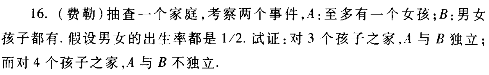

# 概率论与数理统计 作业四

> 第二章13，15，16，其中13，15已于上次作业完成

## 2.16

对3孩之家：

$P(A)=(\frac{1}{2})^3+C_3^2(\frac{1}{2})^3=\frac{1}{2}$

$P(B)=1-(\frac{1}{2})^3\times 2=\frac{3}{4}$

$P(AB)=C_3^1(\frac{1}{2})^3=\frac{3}{8}$

满足$P(AB)=P(A)P(B)$

故独立

对4孩之家：

$P(A)=(\frac{1}{2})^4+C_4^3(\frac{1}{2})^4=\frac{5}{16}$

$P(B)=1-(\frac{1}{2})^4\times 2=\frac{7}{8}$

$P(AB)=C_4^1(\frac{1}{2})^4=\frac{1}{4}$

不满足$P(AB)=P(A)P(B)$

故不独立