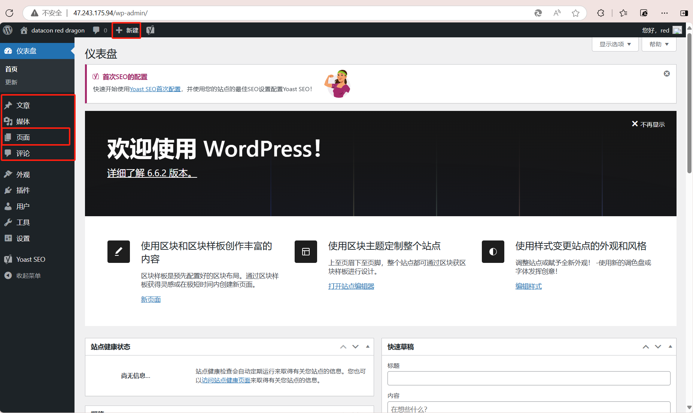
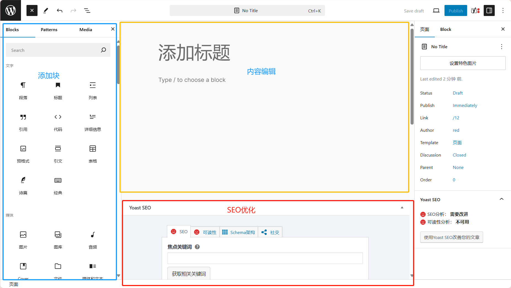
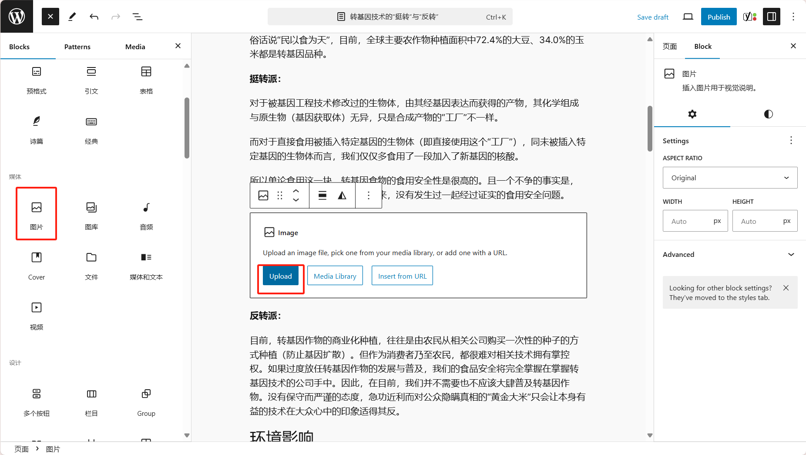
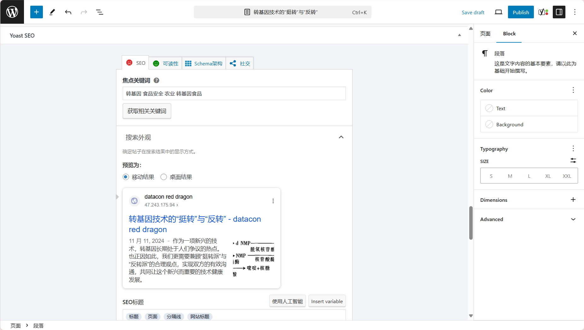
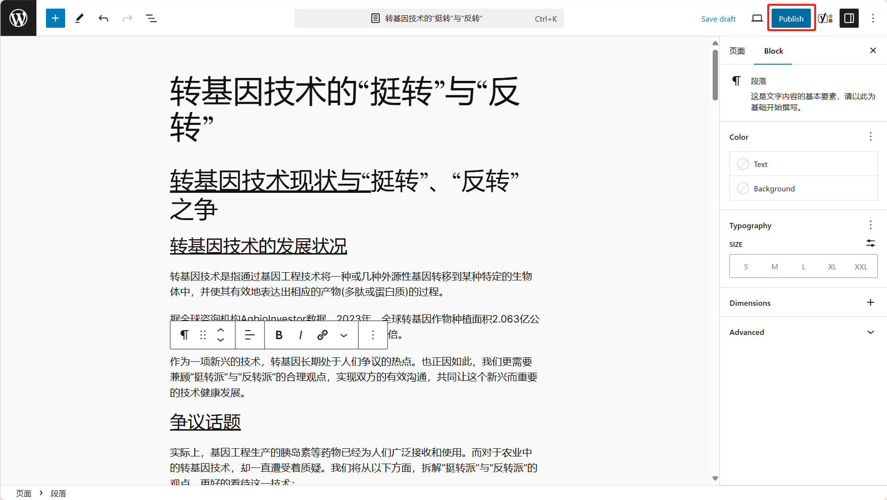
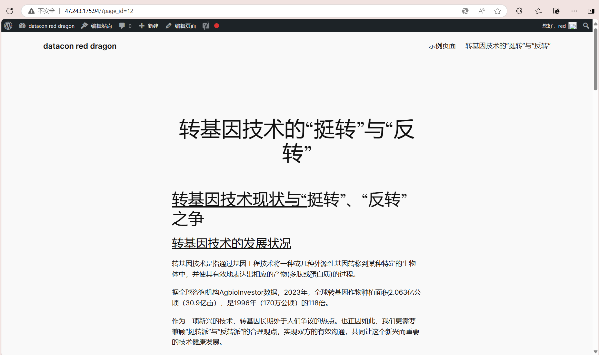
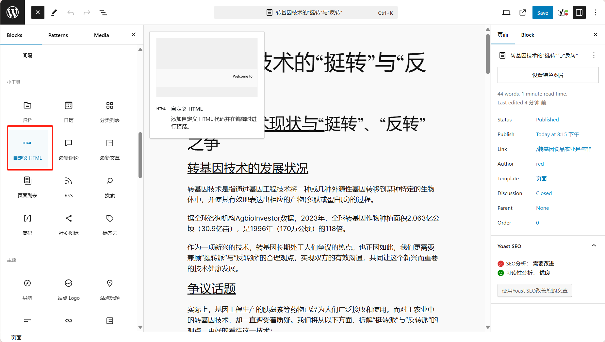

# Web入门

## ABC to know

- h5（html+css+js）：
  - **html（重点）：**[HTML 教程](https://www.w3school.com.cn/html/index.asp)，了解各种元素即可，约30分钟
  - css,js：了解概念即可
- nodejs：[Node.js 教程 | 菜鸟教程](https://www.runoob.com/nodejs/nodejs-tutorial.html)，可以安装nodejs即可

## Intro to Wordpress

### quick start

1. 登录：[47.243.175.94/wp-admin](后台管理页面)

2. 主要关注下面两个部分（尤其是页面和文章）：

   

3. 进入页面，新建一个页面：

   

4. 媒体操作（以图片为例）：

5. 完善相关信息以改善SEO：

   

6. 发布，则会创建新的页面：

   

   

### 详细操作

- 如何使用wordpress：
  - 入门：[WordPress教程 – WordPress新手指南（2021） - 知乎](https://zhuanlan.zhihu.com/p/366551738)
  - 代码操作：

## 其他知识

- Web引擎：apach或**nginx（推荐）**，[Nginx 安装配置 | 菜鸟教程](https://www.runoob.com/linux/nginx-install-setup.html)，可尝试自己在本地Linux虚拟机上启动nginx
- 前端框架：
  - Hexo（[Hexo](https://hexo.io/zh-cn/)）：几分钟便可部署一个博客网站
  - Vue3（[快速上手 | Vue.js](https://cn.vuejs.org/guide/quick-start.html)）：前端框架
  - **Nuxt（[nuxt.com](https://nuxt.com/)）**：在Vue的基础上，通过服务器端渲染等功能封装，更有利于SEO

## Nuxt

### Before begin

- H5基础：见ABC to know
- node.js：见ABC to know
- 快速了解Vue3框架：
  - [十分钟入门vue](https://www.bilibili.com/video/BV1gU411Z7pp?vd_source=a9e5405044d29a94540fd7741a011501)，一个小视频
  - [简单VUE网页](https://github.com/lsq0713/jixinshezao.git)：我之前写的VUE网页，需要把github用户名发给我，我添加之后才可以看到

### Quick start

- 推荐教程：
  - [nuxt3教程 2024年7月](https://www.bilibili.com/video/BV11W421R7nC?vd_source=a9e5405044d29a94540fd7741a011501)，2倍速跳着大概了解一下，关注简单的路由、SEO优化、layout、打包发布即可
  - [简介 · Nuxt 入门 - Nuxt 中文](https://nuxtjs.org.cn/docs/getting-started/introduction)，官方文档，可以参考

### 我们的任务

为了快速搭建我们的Web，我们要采用一些已有的template搭建：

- https://github.com/atinux/content-wind：先试这个
- https://github.com/ZTL-UwU/shadcn-docs-nuxt
- https://github.com/fayazara/zooper
- https://github.com/nuxt/hackernews

按照各自主页上给的guide尝试在loaclhost:3000上运行，再看看可不可以打包（`npm run build`）

## Web安全

### 工具

- nmap：端口扫描
- dirb：Web扫描
- nikto：Web渗透测试
- legion：集成了nmap,dirb,nikto等工具的半自动网络渗透工具
- metaexploit：漏洞利用
- hydra：密码爆破

